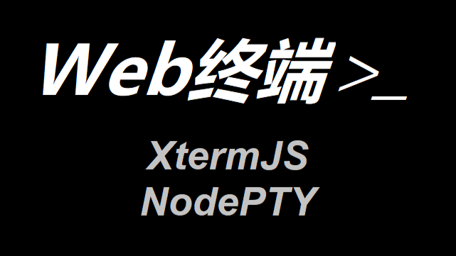

# Remote-Experimental-Environment

<div align=center style="border-radius:20px;">

</div>

<br>

### 演示Demo

http://www.venusxk.com/Console/


### 依赖 dependencies

- "express-ws": "^5.0.2"
- "nan": "^2.17.0"
- "node-gyp": "^9.3.1"
- "node-pty": "^0.10.1"
- "xterm": "^5.1.0"
- "xterm-addon-attach": "^0.8.0"

依赖下载：`npm install`

### `node-pty` 安装问题

见 <a href="./Node-pty安装.md">Node-pty安装.md</a>

### `server.js` 配置事项


#### 环境选择

```js
// win执行下面这条：当为win32时，返回false，表示不使用二进制模式
const USE_BINARY = os.platform() !== "win32";

// linux执行下面这条：当为win32时，返回false，表示不使用二进制模式
const USE_BINARY = os.platform() !== "linux"
```

#### 端口选择

默认为 8086

### 本包使用

```
node server.js
```

或

```cmd
nodemon server.js（热部署）
```

